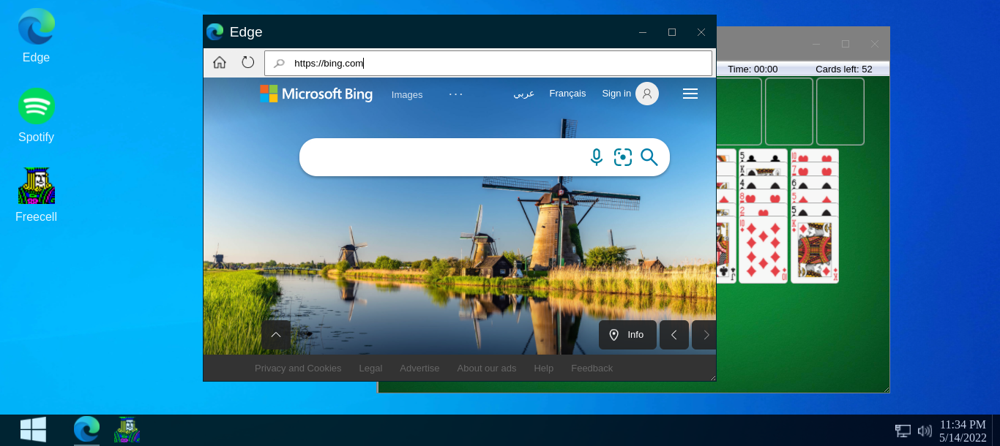

# Win10 Clone (Edu purposes only)

This is small immitation of Microsoft's famous windows 10 on the browser. The purpose of making this is nothing but educational. This app won't at all replace you're daily windows usage by any means but it's there just for fun. feel free to use or copy whatever you like.

## Built With

- HTML, CSS, JavaScript
- Reactjs

## Live Demo

[Netlify](https://clone-win10-edu-purpose-only.netlify.app/)

## Getting Started

To get a local copy up and running follow these simple example steps.

### Prerequisites

- git

- npm

### Setup

- Access the project folder.

- Run npm i or npm install (to install all necessary dependencies).

### Install

- Run npm start to have a local server running the project.

### Test

- Run npm test ( no tests were implemented )

## Authors

👤 **Mohamed Amine Hajltaief**

- GitHub: [@AmineHLub](https://github.com/AmineHLub)
- Twitter: [@Amino47612441](https://twitter.com/Amino47612441)
- LinkedIn: [LinkedIn](https://www.linkedin.com/in/mohamed-amine-hajltaief-b18863163/)

## 🤝 Contributing

Contributions, issues, and feature requests are welcome!

Feel free to check the [issues page](../issues/).

## Show your support

Give a ⭐️ if you like this project!

## Acknowledgments

- the [original product](https://www.microsoft.com/en-us/windows/get-windows-10) of Microsoft Windows 10 belongs to Microsoft .
- All logos, brandnames used belong to and only to Microsoft.
- Microsoft Edge App belongs to Microsoft.
- Spotify app used as an embeded service but the logo and the name belong to 'Spotify', Swedish audio streaming and media services provider founded on 23 April 2006 by Daniel Ek and Martin Lorentzon.
- gnews API for news (free subscription).
- Games are actual website embeded and all rights belong to their original owners.

## 📝 License

- This project is [MIT](./Licenses/MIT.md) licensed.
